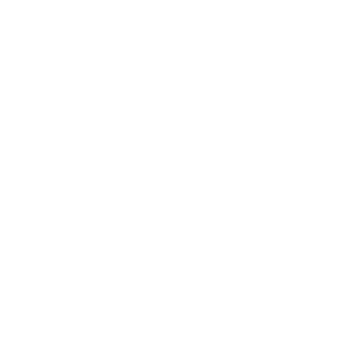

# Shibui (渋い)

A quiet menu bar for Windows. It sits on top of the screen, keeps the work area clear, and stays out of the way until you need it.



## Install

Download **Shibui Setup** from the [latest release](https://github.com/ashu-c-137/shibui/releases/latest). The installer asks which widgets you want on the bar, then starts with Windows when you sign in.

The portable `Shibui.exe` needs no install. The first time it opens, it asks the same question.

## On the bar

- Foreground app
- Now playing, with artwork
- Clock, sound, network, battery
- CPU, GPU, and memory
- Quick search (`Ctrl+Shift+Space`)
- Power and a dashboard for theme, order, and accent

Click the wave mark on the left to open the menu. Click a stat to see usage and uptime.

## Develop

```powershell
npm install
npm start
```

`npm run dev` runs Vite and Electron together. `npm run pack` builds the portable exe and the installer into `release\`.
